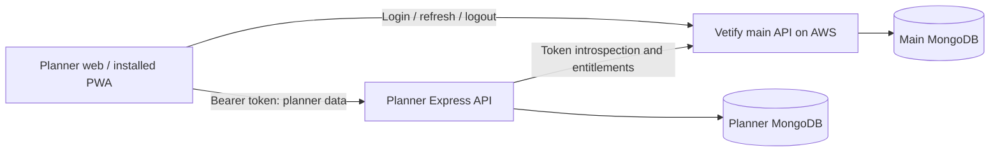

# Standalone Vetify meal planner migration

Prepared 6 October 2026 from the source Vetify repository's MIGRATION_PLAN.md and its code. This records the original planner extraction decisions. The app has its own frontend, backend, repository and database. Vetify remains the authority for accounts and subscriptions.

## Decisions and scope

- Create a separate `vetify-planner` repository with npm workspaces: `apps/web`, `apps/api`, and `packages/shared`.
- Retain React 18, Vite, TypeScript, Tailwind, React Query, Express 5, Zod 4 and the official MongoDB driver. Use Node 24 and a committed lockfile. Resolve compatible versions at initialization.
- The planner owns `pets`, `meal_plans`, `feeding_logs` and `nutrition_observations`. The source audit found no other feature reading pets, apart from the main account export.
- Vetify owns users, passwords, refresh sessions, roles, account status, account preferences and subscriptions. The planner stores the main user ID as an owner reference, never a second account record.
- Start with an installable PWA unless a different installed-app target is selected. Native app-store packaging is a later milestone with its own authentication and secure-storage work.
- Initialize the separate app now. Production cutover waits for the main auth/entitlement contract, feature parity and verified migration. The existing app remains available during that work.
- Preserve current authenticated access. The source has no subscription implementation or agreed list of Pro features. Build and test entitlement middleware, then apply it to explicitly selected capabilities before launch.

## Architecture and deployment

Use two Vercel projects from the planner repository, rooted at `apps/web` and `apps/api`. Serve the frontend at `planner.vetify.com`. Rewrite its `/api/v1/*` requests to the planner API, preserving paths, bodies and authorization headers. An API hostname can remain configurable for a future native client. Authenticate every backend request regardless of its source.

Express is supported as a Vercel Function, so a framework rewrite is unnecessary. Export the app separately from the local listener. Cache the Mongo connection promise per runtime instance, including concurrent initialization, and reset failed connection attempts. Deploy indexes explicitly. Run no core background jobs or Socket.IO server. Verify workspace build dependencies and frontend rewrites in a preview. [Vercel Express documentation](https://vercel.com/docs/frameworks/backend/express), [Node runtime versions](https://vercel.com/docs/functions/runtimes/node-js/node-js-versions).

A separate database on the same cluster still shares cluster failures. Use separate credentials and a separate Atlas deployment for production database fault isolation. Local development can use a separate database on the existing local Mongo server. A main auth outage can prevent planner access after its short authorization cache expires, while a planner outage must leave main login and other features available.

## Complete extraction map

| Source                                                                                                                          | Destination and treatment                                                                                                   |
| ------------------------------------------------------------------------------------------------------------------------------- | --------------------------------------------------------------------------------------------------------------------------- |
| `src/client/pages/planner/`                                                                                                     | `apps/web/src/features/planner/`: copy all 19 files, including pet form/cards, daily budget and meal-log components.        |
| `src/client/services/{pets,meal-plans,nutrition-observations}.service.ts`                                                       | Planner API client services. Preserve request and response shapes.                                                          |
| `src/shared/{pets,pet-age,meal-plans,meal-calculation,meal-intake,nutrition-observations,planner-date}.ts`                      | Private `packages/shared` domain package with explicit ESM exports for web and API.                                         |
| `src/server/routes/v1/{pets,meal-plans,nutrition-observations}.route.ts`                                                        | Planner API routes. Replace auth, caller and account-date dependencies.                                                     |
| `src/server/models/{pets,meal-plans,feeding-logs,nutrition-observations}.ts`                                                    | Planner repositories and their four collections. Use planner-only index registration.                                       |
| `src/server/middleware/{validate,errorHandler}.ts`, `src/server/utils/{response,AppError}.ts`, `src/server/models/object-id.ts` | Bring minimal support and adapt imports. Avoid the monolithic models barrel.                                                |
| `src/client/hooks/useDocumentTitle.ts`, relevant `src/client/globals.css`, Tailwind setup and favicon                           | Minimal layout and styles. Move the pet form's `FIELD` constant locally rather than importing settings controls.            |
| Planner client, server and calculation tests                                                                                    | Port fixtures to a controlled mock of main introspection. Carry the behavior assertions, not the core user/password models. |

Rebuild the frontend entry, providers and authenticated layout. Copying the current root imports chat, preferences, locale and realtime features. Create planner-only server startup and environment validation. Do not import Gemini keys, the core JWT signing secret, books, clinic jobs or appointment jobs. Keep shared main-contract types small and versioned locally until a real published `@vetify/shared` package exists.

## Main-system prerequisites and proposed contract

These are required changes in the original Vetify repository. They do not exist today. Initialization in a new folder produces a contract and integration checklist for them, without modifying the source repository.

1. Add a credentialed CORS allowlist for exact planner/main origins and OPTIONS. Retain `CLIENT_ORIGIN` as the canonical origin used in emails. Add a separate `ALLOWED_ORIGINS` setting rather than replacing that URL with a comma-separated list.
2. Extend main login and OAuth completion to accept an HTTPS `returnTo` whose parsed origin exactly matches the configured allowlist. Preserve only validated return state across OAuth. Reject credentials, protocol-relative URLs, lookalike hosts and arbitrary subdomains. Allow exact local development origins separately.
3. Add subscription storage and authoritative capability evaluation, including account suspension/deactivation and expiry. Keep role and subscription separate. Admin-controlled test subscriptions are enough before a payment provider is chosen.
4. Add `POST /api/v1/auth/introspect`, authenticated by the presented main-issued Bearer token. Verify its signature, expiry and current account status in main. Return only the minimal, Zod-validated version-1 contract below. The planner has no HS256 signing secret.
5. Update main account export at cutover: return core data and a planner export link, with a separately authenticated planner export. Update `account.service.ts` and its tests. Main requests must complete when the planner is unavailable.

Proposed introspection body: `{ version: 1, user: { id, role, status }, region: { timeZone }, subscription: { plan, status, expiresAt }, entitlements: string[], tokenExpiresAt, validUntil }`. IDs are strings over HTTP. `validUntil` must not exceed verified token expiry or the next entitlement/status validity boundary. No password, refresh token or signing material is returned.

Use 401 for invalid/expired credentials, 403 for a blocked account or missing capability, and 503 for main timeout/unavailable/malformed output. The backend may cache positive results for at most 30 seconds, capped by `validUntil`. Key a bounded cache by token digest. Never serve expired or stale authorization during an outage. Account bans and subscription changes take effect within that stated window. Redact tokens from logs.

Replace `routes/v1/caller.ts` with the introspected principal and `account-today.ts` with its validated account timezone. Keep the existing `Asia/Manila` fallback only when the contract explicitly omits a timezone. Preserve each saved plan's timezone and date rules.

## Browser and installed-app authentication

- Use distinct `VITE_MAIN_API_URL` and `VITE_PLANNER_API_URL`. These and backend `MAIN_API_URL` are versioned bases ending in `/api/v1`, with no trailing slash. Append `/auth/refresh` or `/auth/introspect` once. Planner calls use Bearer headers and omit cookies; main auth calls include credentials. A copied single-base `api.ts` would refresh at the wrong service.
- Always attempt main `/auth/refresh` on first load, even with no stored user on the new origin. Wait for bootstrap before redirecting. A network failure shows retry, while an authentication refusal sends the user to main login with validated `returnTo`.
- Keep the short-lived access token in memory for the new web app. Main retains its httpOnly refresh cookie. Refresh once across concurrent 401s, replay at most once, and preserve reason codes. Do not treat 403 or 503 as a logout.
- Clear React Query data and planner drafts on account changes/logout, and scope cache/draft keys by main user ID. Existing sessionStorage drafts cannot move automatically to the new origin. Let users finish drafts before cutover or explicitly restart them.
- All browser refresh calls target the same main API host. A host-only cookie on that host can support same-site credentialed calls from sibling apps. A `.vetify.com` cookie is therefore optional for this flow, rather than a required SSO enabler. If the existing domain-cookie proposal is adopted, match its domain/path when clearing it and account for the one-time session reset. [Cookie scope](https://developer.mozilla.org/en-US/docs/Web/HTTP/Reference/Headers/Set-Cookie), [credentialed Fetch](https://developer.mozilla.org/en-US/docs/Web/API/Fetch_API/Using_Fetch).
- Use HTTPS sibling domains for production SSO validation. A `vercel.app` preview is cross-site to Vetify and cannot prove the proposed SameSite=Lax flow. Use a same-site staging hostname or the local mock for preview testing.
- PWA installation remains browser-based auth. Test login, logout and relaunch on supported devices instead of assuming every installed browser container shares its session. Cache shell assets only initially. Auth and API requests stay online, and offline writes/reminders are outside this migration. [PWA installation](https://web.dev/learn/pwa/installation).
- A later native wrapper must add a reviewed login/refresh protocol and Keychain/Keystore token storage. Current main auth returns refresh tokens only as browser cookies, so native auth requires real main changes before release.

## API and behavior parity

Keep these existing routes beneath `/api/v1`: `GET/POST /pets`, `PUT /pets/:id`, `GET /meal-plans?petId=...`, `POST /meal-plans/preview`, `POST /meal-plans`, `GET /meal-plans/:id/logs?date=...`, `PUT /meal-plans/:id/logs`, and `GET/POST /nutrition-observations`. Logs carry intake and extras, so no new meal-intake endpoint is needed. A planner `GET /session` may expose the minimal validated principal/capabilities for its UI, and an authenticated `GET /export` supplies planner data.

Preserve multi-pet ownership, age provenance, the estimate-versus-existing-amount routes, adult eligibility blockers, food identity/energy conversions, warnings, preview without persistence, explicit save, request-ID idempotency, plan versions and snapshots, Today/week/history views, actual grams/extras, and intake from older plans changed on the same day. Recompute previews server-side and never trust a submitted calculation. Preserve unknown versus zero intake.

Legacy pet `bodyConditionScore` uses 1–10, while new plan/observation `conditionScore` uses 1–9. Preserve both without automatic conversion. Retain the existing nutrition rules and tests. Changing clinical behavior is outside this extraction.

## Sequenced implementation

1. **Initialize:** require the resolved destination to be outside the source repository, then inventory imports and create the workspace, separate API clients, planner-only shells and local Mongo database. Deliver a loopback-only mock main with a browser login/validated return flow and login, refresh, logout and introspection routes. Use its own cookie name. Production startup must reject mock mode.
2. **Restore parity:** port domain logic, repositories/indexes, routes, services and screens. Rewrite caller/timezone access through introspection. Build the shared package before consumers, and verify the emitted server actually starts with resolvable imports.
3. **Prepare core integration:** document and implement the main prerequisite work in the main repository as a separate task. Connect real auth, return navigation, capability checks and account export. Keep mock success distinct from real SSO evidence.
4. **Add installability:** manifest, icons, standalone display, static-shell service worker, offline/retry UI and installation guidance. Validate installation and relaunch. Do not add queued feeding writes in this phase.
5. **Stage and migrate:** configure two Vercel projects, separate Atlas access and same-site staging. Rehearse migration/rollback using synthetic fixtures, then a backup of real data when separately scheduled.
6. **Cut over:** switch main navigation and `/planner` to the standalone app after real auth and data checks pass. Preserve the old implementation for rollback, but allow exactly one database/service to accept planner writes.

## Data migration and rollback

The source plan's generic dual-write proposal is unnecessary for an unreleased or low-volume feature. Prefer a scheduled, bounded write freeze. If uninterrupted writes are required, first implement durable replay with checkpoints and idempotency rather than ad hoc writes to two databases.

1. Inventory real data and take a recoverable backup. If all four collections are empty, create indexes and skip backfill.
2. Provide a dry-run-first migration command with explicitly separate source and target connections. Its copy operation covers all four collections, preserving BSON `_id`, `petId`, `planId` and dates. Convert only `ownerId` from its current BSON ObjectId to the main ID string and update every planner owner filter consistently. Never copy `users` or refresh sessions. Before the freeze, perform read-only dry runs and rehearsals in synthetic databases only.
3. Preserve pet age-reference fields, plan `requestId`, version, preview, timezone, activation windows and pet snapshots, plus logs and observations unchanged. Upsert by original `_id`; reruns skip identical records and reject unexpected conflicting target records.
4. Recreate pet owner/date and observation owner/pet/date indexes, unique plan owner/pet/version and owner/requestId indexes, and unique log owner/plan/day/meal indexes.
5. Compare counts per collection/owner, hashes normalized only for owner conversion, relationship ownership, version sequences, unique keys and dates. Counts alone do not establish correctness.
6. Freeze old pet/planner/observation writes before the first real backfill. Copy into a clean destination, or resume an identical interrupted copy while the freeze remains in force. Verify again against that frozen source, then switch all planner routes to the new authority. This avoids conflicts caused by source edits between copies. The main server must not remain an alternative writable planner API.
7. Keep source collections and backup through the agreed rollback period. Before new writes, rollback can restore the old route. After new writes, freeze the new service and reverse-reconcile them, including owner type conversion, before routing back. Never restore a stale database as if it were current.

Deactivation retains data but makes it inaccessible through main status checks. For future deletion/anonymization, use durable authenticated lifecycle delivery with retries and idempotent planner cleanup. Main records pending delivery and completes its account action even during planner outages. Do not add deletion during initialization simply because the service was split.

## Completion evidence

- Run web and API type checks, lint, both production builds, and an actual built API startup check. TypeScript aliases alone do not make imports work in Node.
- Port `pet-form`, `plan-wizard`, `daily-budget`, `pets.route`, `meal-plans.route`, `pet-age`, `meal-calculation`, `meal-intake` and `meal-planner-fixtures` tests. Add focused cases for main failures, blocked accounts, entitlement expiry/cache bounds, user switching, refresh concurrency and timezone boundaries.
- Exercise two owners through create pet, preview, save/retry, log feeding/extras, change plan, inspect history and record weight/condition. Confirm one owner cannot access another's records.
- Rehearse idempotent migration and reverse migration. Validate duplicate constraints and prove that records created after cutover, plus edits to existing pets/logs and plan activation windows, survive rollback.
- Before production release, prove login from main into a new planner origin, refresh, logout/relaunch, Pro refusal, direct API ownership checks, main survival during planner failure, and app installation on supported devices.
- Initialization is complete when the standalone app works locally with its documented mock and database, and its checks pass. Production migration is complete only after real main integration, deployment and data cutover evidence exists.

The initialization described here has been implemented in this repository. See README.md and the current integration, deployment and migration documents for execution details. Remaining release decisions are the actual Pro capability list, deployed main API hostname, migration window and any native app-store target.
